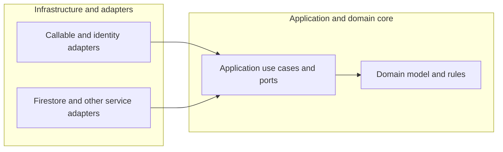

# Backend foundation strategy

**Status:** Strategy baseline and complete CI/CD path approved. The `fm-budget-planner/backend` checkout, origin, issue #1, and current issue branch were verified on September 19, 2026. The user has authorized documentation-only work on issue #1; future implementation in Codex inside Visual Studio Code requires explicit user authorization for the selected issue.

**Date:** September 16, 2026

**Last updated:** September 19, 2026

**Scope:** Budget Planner, one product built by a small team; domain requirements and model to be defined later.

## Collaboration and implementation authorization

The user creates all GitHub issues and chooses the implementation scope. Codex implements only the explicitly authorized issue, on a branch associated with that issue. Codex must never create GitHub issues, commit, push, or merge; the user reviews changes and commits personally. Preserve existing and unrelated work, perform appropriate validation, summarize results and unresolved questions, and leave changes uncommitted. When decisions are needed, ask one question at a time and explain the trade-offs of each alternative. See the repository's [working instructions](../AGENTS.md).

Manual issue creation is separate from the approved future issue-to-branch automation: an authorized teammate marks a user-created issue ready for development, and automation creates its linked branch from `main`. Readiness does not replace the user's explicit authorization for Codex to implement the issue. Preserve the technical automation decisions in the [CI/CD foundation](ci-cd-foundation.md); no automation is installed by issue #1.

## 1. Purpose and constraints

Establish a backend foundation for an initial production release to early users. The eventual implementation scope is backend only. Web and mobile implementation will be addressed separately, while their integration requirements inform the backend boundary.

| Area | Agreed decision |
|---|---|
| Product | Budget Planner; domain requirements and model remain to be defined |
| Team | Small team working together |
| Initial audience | The product's own web and mobile applications |
| Planning scale | Up to 1,000 monthly active users; not a registration cap |
| Budget | USD 25/month target across staging and production combined |
| Architecture | Hexagonal architecture and domain-driven design |
| Codebase | One public GitHub repository with separate Core and Firebase Runtime packages; runtime consumes core from the same commit |
| Source repository owner | User-created [fm-budget-planner](https://github.com/fm-budget-planner) organization; GitHub Free selected, plan verification pending |
| Repository name | `backend`; `fm-budget-planner/backend` checkout and origin verified |
| Implementation workspace | Codex extension inside Visual Studio Code, working in the local backend repository checkout; standalone chat used for planning and handoff |
| Change origin | The user creates every GitHub Issue and chooses scope; an authorized teammate marking it ready for development triggers creation of a linked working branch from `main`; Codex implementation requires explicit user authorization |
| Language/runtime | TypeScript on Node.js; exact versions left to implementation |
| Infrastructure | Firebase Authentication, Cloud Functions for Firebase, and Cloud Firestore |
| Application-data access | All client reads and writes pass through backend functions |
| Ownership | Individual user ownership; organization/workspace ownership is outside the initial model |

The scale and budget are planning assumptions. Neither is an enforced limit or a verified capacity/cost estimate.

## 2. Architectural boundary

The primary boundary separates the application and domain core from infrastructure and adapters.

| Inside the core | Outside the core |
|---|---|
| Domain concepts, business rules, and invariants | Firebase callable request handling |
| Application use cases and orchestration | Firebase Authentication integration and identity translation |
| Core-owned ports for required interactions | Firestore persistence and SDK interaction |
| Application/domain types | External representations, serialization, and service-specific errors |

**Code dependencies point inward.** Adapters depend on core contracts. Application and domain code do not depend on Firebase SDK types. The application can be exercised through its ports independently of Firebase. This follows the [ports-and-adapters model](https://alistair.cockburn.us/hexagonal-architecture).

The diagram shows code dependencies, rather than the direction of runtime requests:

The system remains a single product backend. Exported Firebase functions are separate deployment units. Core and Firebase Runtime are separate packages in one public GitHub repository, with automated enforcement of inward dependencies. Runtime includes inbound and outbound adapters, composition, and deployment configuration, and consumes core from the same commit. Core is a library with its own validation workflow; it does not require independent publication or cloud deployment.

DDD guides the eventual domain model. Bounded contexts, aggregates, business invariants, and workflows remain open until the product domain is understood. The foundation should not invent business entities or generic domain frameworks in advance.

**Accepted trade-off:** explicit contracts and conversion code add work, while keeping business behavior independently testable and infrastructure dependencies contained.

## 3. API, identity, and access

### Application API

Use Firebase callable functions for the product's own clients. Callable SDKs attach available identity and App Check tokens, and the callable runtime validates supplied authentication tokens. Protected operations must still explicitly require authentication and enforce authorization. See [Firebase callable functions](https://firebase.google.com/docs/functions/callable).

All application-data reads and writes go through this backend. Direct client Firestore access is denied. Firebase Authentication sign-in remains a normal client-to-Authentication interaction; it is separate from application-data access.

Firebase server/Admin SDK access bypasses Firestore Security Rules, so ownership and authorization checks belong in the backend and cannot be delegated to client-facing rules. See [Firestore server access and Security Rules](https://firebase.google.com/docs/firestore/security/rules-conditions).

### Identity policy

- Registration is open.
- Initial sign-in methods are email/password and Google.
- Verified email is required before protected product operations.
- Onboarding, email verification, and account recovery remain accessible as needed.
- Trust Firebase's verified-email claim, rather than a client-provided field; Google sign-in satisfies the requirement when that claim is present.
- Application data is owned by individual users, with access checked against the authenticated identity.

### App Check

Enforce App Check at public launch after staging validation. Client integration is a launch dependency to address when frontend work begins. App Check supplements authentication, authorization, and request limits. Missing or invalid tokens are rejected when enforcement is enabled. See [App Check enforcement for callable functions](https://firebase.google.com/docs/app-check/cloud-functions).

### Compatibility policy

Support only the latest backend interface. Breaking changes may require coordinated backend/client releases, and older clients may require an update before continuing. There is no commitment to maintain older interface versions during a migration period.

The eventual client update experience is a frontend concern; the backend contract must account for this accepted policy.

**Accepted trade-offs:** callable APIs fit Firebase clients but couple the transport to the Firebase callable protocol. Backend-mediated data access centralizes authorization and use cases while adding backend work to every application-data request. Supporting only the latest interface reduces compatibility maintenance while making release coordination more important.

## 4. Environments and release strategy

| Environment | Strategy |
|---|---|
| Local | Firebase Emulator Suite for local development and integration testing |
| Staging | Separate Firebase project; automatic deployment after checks for merged changes affecting deployable backend inputs |
| Production | Separate Firebase project; team approval before deployment |

For staging and production, use **`us-central1` (Iowa)** for Cloud Functions and a co-located regional Firestore database. This is the selected cost-first default; it is not a claim that Iowa is uniquely cheapest for every workload. Relevant references: [Functions locations](https://firebase.google.com/docs/functions/locations), [Firestore locations](https://firebase.google.com/docs/firestore/locations), and [Firestore pricing](https://cloud.google.com/firestore/pricing).

For changes affecting deployable backend inputs, the release flow is:

1. Review the change.
2. Run automated checks and tests.
3. Deploy to staging automatically.
4. Validate in staging.
5. Obtain team approval and deploy to production.

Brief, announced maintenance windows are acceptable when a release or data change needs them. This permits planned interruptions; it does not require downtime for every deployment or establish incident-response coverage.

## 5. Quality strategy

Use broad automated testing across implemented backend workflows, including edge cases and failure paths. Coverage grows with the actual implemented behavior.

The architecture supports three complementary areas of validation:

- Core tests for application behavior and eventual domain rules, independent of Firebase.
- Integration tests for adapters and interactions among emulated Firebase services.
- Staging validation of the deployed backend and configuration.

Core and runtime have dedicated CI workflows. Core validation remains Firebase-free. Because runtime consumes core from the same commit, core production-code changes also trigger runtime build and applicable integration checks. Shared dependency/configuration changes require checks for every affected package. Changes limited to tests or documentation do not require cloud deployment when deployable inputs are unchanged.

SonarQube Cloud is selected to add source-quality analysis and coverage reporting through separate Core and Firebase Runtime projects linked to the same GitHub repository. Each package independently uses the built-in Sonar way quality gate and its defaults. Applicable gates are required merge checks from the first integration, with no advisory rollout period. Sonar complements the existing tests and dependency-boundary checks. The specific criteria are recorded in the CI/CD plan. The technical selection is approved and free-plan fit will be verified during explicitly authorized setup; no paid subscription has been approved.

GitHub Dependency Review is a required PR check for dependency changes. Newly introduced high or critical known vulnerabilities block merging; moderate and low findings are reported for reviewer assessment. Enable Dependabot alerts for supported existing dependencies on the default branch, with team triage and remediation through the issue-first process. Keep automatic security/version-update PR creation disabled. These alerts do not add an automatic release gate or establish which dependency versions are deployed.

Use native GitHub secret scanning and explicitly configured repository push protection. This adds detection of supported credential patterns and prevention of supported secrets being published through a push, with low maintenance effort. No extra local/CI secret scanner is selected. Repository security findings belong to this protection; product monitoring and alerting remain deferred.

Use actionlint as a required check for GitHub Actions workflow and lint-configuration changes. It provides lightweight workflow correctness checks and some unsafe-pattern detection. Review remains responsible for the security of permissions and credential handling. Additional CodeQL workflow analysis is not selected.

Use on-demand, advisory Codex GitHub reviews for consequential PRs, especially authentication/ownership, persistence, changes spanning Core and adapters, and release workflows. Keep automatic reviews disabled initially and assess confirmed useful findings against human review effort and usage before proposing broader adoption. Codex adds no mandatory merge status and does not replace the required non-author human approval or existing checks. Corrections within the explicitly authorized scope stay on the existing issue-linked branch; unrelated changes require a user-created issue and explicit user authorization before Codex implementation. Verify existing eligible access and usage limits during setup; no additional subscription or paid credits are approved. See [Codex GitHub review](https://learn.chatgpt.com/docs/third-party/github).

Authentication requirements, verified-email admission, ownership isolation, input validation, and essential persistence behavior belong in this coverage. Business workflows are added when the domain is defined.

The [Firebase Emulator Suite](https://firebase.google.com/docs/emulator-suite) supports local integration testing. Staging remains necessary to exercise real cloud deployment and configuration; local emulation does not replace that environment.

Specific testing libraries, directory layouts, and runtime versions are implementation details to derive from this strategy. Sonar way's coverage threshold and small-change exception are selected; no additional numerical coverage target has been set.

**Accepted trade-off:** broader testing requires more initial effort and maintenance in exchange for greater confidence when the backend changes.

## 6. Cost and scaling strategy

- Target USD 25/month for staging and production combined.
- Plan initially for up to 1,000 monthly active users.
- Allow functions to scale to zero in both cloud environments.
- Use conservative request and scaling limits.
- Determine numerical limits from representative workload measurements.

Scaling to zero avoids reserving warm function instances but accepts cold-start latency. Scaling ceilings can constrain resource use and may lead to rejected requests at capacity. They do not create an exact monthly spending cap. See [Firebase scaling controls](https://firebase.google.com/docs/functions/manage-functions).

The cost model remains open until request frequency, reads/writes per operation, data size, retention, network traffic, and cloud testing activity are known. Monthly active users alone cannot establish either capacity or cost feasibility.

Automated budget alerts and spend-triggered shutdowns are not part of the selected baseline.

## 7. Explicitly deferred scope

The following are deferred by decision:

- Scheduled Firestore backups and point-in-time recovery.
- Application/runtime monitoring and alerts, including budget alerts. Selected GitHub repository security detection and notifications are part of the foundation.
- Account cancellation and deletion policy or workflows.
- Frontend web and mobile implementation.

These items are not included as additional gates in the initial strategy. Other Firebase services are introduced when a concrete requirement calls for them.

## 8. Decisions that remain open

| Open area | Why it remains open |
|---|---|
| Product domain and use cases | Intentionally postponed |
| Bounded contexts, aggregates, and invariants | Must follow the domain rather than be invented for the foundation |
| Data model, query patterns, and transaction boundaries | Depend on product behavior |
| Capacity and cost feasibility | Require a representative usage model and measurements |
| Numerical request/scaling limits | Depend on tested workload characteristics |
| Incident coverage and service-level targets | No working-hours, on-call, or uptime commitment was selected |
| Diagnostic logging policy | Not decided; deferring automated monitoring does not establish a logging policy |

## 9. Immediate priority: CI/CD foundation

The implementation priority, once explicitly authorized through user-selected issues, is the CI/CD foundation before product requirements and solution design. Upcoming changes should enter through automated checks and the agreed staging-to-production release process from the beginning. Issue #1 records the documentation only.

The selected platform is GitHub Actions with one public GitHub repository, separate Core and Firebase Runtime packages, and dedicated workflows. Both packages are consumed from the same revision. The selected policies include automated branch creation when an authorized teammate marks an issue ready for development, peer review and checks before merge, automatic staging for deployable changes, and manually requested production releases with designated approval. Separate SonarQube Cloud projects apply Sonar way independently, with applicable results required from first integration. Dependency review blocks newly introduced high/critical known vulnerabilities. Native secret protection, required actionlint checks, Dependabot alerts with issue-first remediation, and on-demand advisory Codex reviews complete the selected tooling additions. The user has approved the consolidated technical plan, while retaining issue creation, scope selection, and implementation authorization. No pipeline has been installed or run in this work. See [CI/CD foundation](ci-cd-foundation.md).

Domain-specific design remains deferred. Implementation mechanics should follow the agreed architecture rather than reopen settled strategic choices.
