# CI/CD foundation

**Status:** Complete technical CI/CD path approved. The `fm-budget-planner/backend` checkout and origin were verified, and issue #1 was read through the GitHub connector on September 19, 2026. Only issue #1's documentation scope is currently authorized; future implementation in Codex inside Visual Studio Code requires explicit user authorization for the selected issue. GitHub Free is the selected plan; account-plan verification, provider eligibility, and usage limits remain setup checks. No new paid commitment is selected. No pipeline has been installed or run in this work.

**Date:** September 16, 2026

**Last updated:** September 19, 2026

## Objective

Establish automated checks and the staging-to-production release process for Budget Planner before product requirements and solution design. Carry forward the agreed policy: reviewed changes, automated staging deployment, validation, and team approval for production.

The user approved the consolidated technical path. That approval is not blanket implementation authorization: the user creates all GitHub issues, chooses their scope, and explicitly authorizes Codex to implement each issue. Issue #1 brings these plans and the working instructions into the repository; workflow installation and cloud configuration have not begun in this work.

### Collaboration rules

Implement only the explicitly authorized issue on a branch associated with it. Codex must never create GitHub issues, commit, push, or merge. The user reviews changes and commits personally. Preserve existing and unrelated work, perform appropriate validation, summarize results and unresolved questions, and leave changes uncommitted. When decisions are needed, ask one question at a time and explain the trade-offs of each alternative. Follow the repository's [working instructions](../AGENTS.md).

Manual issue creation and scope selection are the user's responsibilities. The separately approved readiness-triggered branch automation remains part of this technical plan. A readiness action creates a linked branch; it does not replace explicit user authorization for Codex implementation. This distinction preserves the issue-association checks and all other approved CI/CD automation.

### Implementation workspace

The user selected Codex inside Visual Studio Code for implementation. Use the extension's local workspace workflow for authorized code, tests, configuration, and CI/CD changes in the actual backend repository checkout. Planning or handoff conversations do not independently authorize implementation.

The approved plans now live under the repository's `docs/` directory. Read them and [AGENTS.md](../AGENTS.md), verify the target repository and available GitHub access in each implementation session, and preserve the issue-first process before project-file changes. Do not assume earlier conversation history or another application's GitHub connection is inherited. See [VS Code handoff](vscode-handoff.md).

## Selected repository and package strategy

Use one public GitHub repository with separate **Core** and **Firebase Runtime** packages. Runtime consumes core source from the same repository revision. A single reviewed PR can update a core port, its adapters, and their tests together.

### Repository ownership

The user created [fm-budget-planner](https://github.com/fm-budget-planner) manually and confirmed it as the repository owner. Its public organization page was verified during planning. The `fm-budget-planner/backend` local checkout and origin are now verified, and issue #1 is readable through the GitHub connector. GitHub Free remains the selected plan, with plan verification pending. Team members use their own GitHub accounts; the organization supports shared administration and team access controls.

The assistant must not create an organization on the user's behalf. The earlier planning session had a GitHub connection mismatch; that historical limitation does not describe the connector used to read issue #1. Verify access independently when needed. Reading an issue does not establish local Git write access or administrative permissions, and Codex must never commit, push, or merge.

**Accepted trade-off:** additional organization setup and membership administration in exchange for shared ownership and access management. For this public repository, the selected GitHub merge, deployment, and repository security controls are available on the free organization plan. Configure protection within the repository; paid organization-wide rulesets are not required. GitHub Team is not selected. See [GitHub plans](https://docs.github.com/en/get-started/learning-about-github/githubs-plans).

### Package responsibilities

| Package | Responsibility | Dedicated workflow responsibility |
|---|---|---|
| Core | Application/domain behavior, types, and core-owned ports | Validate its types, build, architecture boundaries, and behavior without Firebase dependencies, credentials, configuration, or emulators |
| Firebase Runtime | Inbound callable/identity adapters, outbound persistence/service adapters, composition, and Firebase configuration | Validate runtime code, core integration, and applicable emulator tests; deployment workflows release the assembled backend |

Code dependencies point inward: runtime depends on core contracts; core cannot import runtime or Firebase SDK types. Enforce this boundary through package contracts and automated dependency checks. Separate workflows do not require separate repositories. GitHub supports [multiple workflows in one repository](https://docs.github.com/en/actions/concepts/workflows-and-actions/workflows).

Core is a library, not a separately deployed service. This baseline does not require independent core publication or a later version-adoption PR. Each release candidate fixes both packages to one immutable commit, together with reviewed dependency lockfiles, configuration, and build inputs.

**Accepted trade-off:** simpler coordination and atomic core/adapter changes, while changes to core consumed by runtime also require consumer validation. Independent core release cadence is not part of this baseline.

### Validation and deployment scope

The core workflow always remains Firebase-free. Dependency impact determines when the separate runtime workflow must also run. A core behavior change can affect runtime compatibility even when a port signature is unchanged; for example, a new domain invariant can reject records loaded by an existing Firestore adapter.

| Change | Required validation | Cloud deployment after merge |
|---|---|---|
| Core production code | Core checks plus runtime build and applicable integration tests | Automatic staging deployment of the assembled backend |
| Runtime production code or deployable Firebase configuration | Runtime checks and applicable integration tests | Automatic staging deployment |
| Shared dependencies, lockfiles, build configuration, or tooling | Checks for every affected package; expand to both when impact is uncertain | Staging deployment when deployable inputs change |
| Tests or documentation only | Applicable test/documentation checks and standard PR controls | No deployment when deployable inputs are unchanged |

Initially, conservatively treat all core production-code changes as affecting runtime. Select relevant runtime test suites without claiming that file paths alone prove behavioral independence. Test-suite organization and change-detection tooling are implementation details.

Use an always-reporting required PR gate to confirm that every applicable required package check passed. Missing, failed, or cancelled applicable required checks must block merging. Avoid relying on required workflows that disappear entirely through path filters: GitHub documents that [skipped workflows can leave required checks pending](https://docs.github.com/en/pull-requests/how-tos/merge-and-close-pull-requests/troubleshooting-required-status-checks).

## Agreed CI/CD decisions

| Decision | Selected policy |
|---|---|
| Platform | GitHub for source control and GitHub Actions for CI/CD |
| Repository owner | User-created `fm-budget-planner` organization; GitHub Free selected |
| Repository name | `backend`; `fm-budget-planner/backend` checkout and origin verified |
| Visibility | Public repository, to use the protection features available for public repositories |
| Package lifecycle | Separate Core and Firebase Runtime packages and workflows in one repository; runtime consumes core from the same commit |
| Source-quality analysis | Separate SonarQube Cloud projects for Core and Firebase Runtime; built-in Sonar way evaluated independently, with applicable gates required from the first integration |
| Dependency vulnerabilities | Required GitHub Dependency Review check blocks dependency changes introducing high or critical known vulnerabilities; lower-severity findings are reported for review |
| Newly disclosed dependency vulnerabilities | Dependabot alerts on default-branch dependencies; team-reviewed remediation through the issue-first process, with automatic security/version-update PRs disabled |
| Secret protection | Native GitHub secret scanning and explicitly configured repository push protection; no additional local/CI secret scanner |
| Workflow validation | Required actionlint checks for GitHub Actions workflow changes; additional CodeQL workflow scanning is not selected |
| Origin of changes | The user creates all GitHub Issues and chooses scope; each implementation uses its issue-linked branch, with explicit user authorization for Codex; automate branch creation separately |
| Branch-creation trigger | An authorized teammate marks the issue ready for development; automation creates its linked branch from the current `main` |
| Branching | One permanent branch, `main`, with short-lived working branches |
| Merge review | One approval from someone other than the author, plus passing automated checks |
| Codex review | On-demand, advisory GitHub PR reviews for consequential changes; assess usefulness before considering automatic reviews |
| Staging | Automatic deployment and validation after a reviewed change affecting deployable backend inputs merges into `main` |
| Production initiation | A teammate manually requests release of a revision already validated in staging |
| Candidate selection | Select the latest successfully validated staging revision available when the release request is created; freeze that revision for the request |
| Production approval | A designated approver must approve; the initiator may also be that approver |
| Recovery | Team-directed investigation and recovery; no automatic rollback |

Code review before merge and production approval after staging are distinct decisions. A manual release request does not itself substitute for production approval.

## Codex GitHub review

Use on-demand Codex reviews as an additional advisory review of consequential PRs, especially authentication/ownership, persistence, changes spanning Core and adapters, and release workflows. A teammate requests a review with `@codex review` when the PR is ready. Automatic reviews are not selected. See [Codex GitHub review](https://learn.chatgpt.com/docs/third-party/github).

Keep the existing required checks and one non-author human approval. Codex does not supply that human approval or a required merge status. A missing, unavailable, or positive AI review does not establish correctness; its absence does not independently block a merge. Human reviewers assess findings and address confirmed defects before approving. Substantive later changes may warrant another request because a review concerns the code examined.

Provide concise repository-wide and package-specific review guidance in the applicable `AGENTS.md` files. Focus on consequential behavior such as ownership enforcement, compatibility between Core and stored data, and deployment of the approved revision. Keep mechanical formatting and dependency-boundary enforcement in CI. See [scoped review guidance](https://learn.chatgpt.com/use-cases/github-code-reviews).

Review adoption does not enable automatic fixes or merges. Fixes within the explicitly authorized scope remain on the reviewed PR's existing issue-linked branch and undergo the normal checks and human review; unrelated work requires its own user-created issue, linked branch, and explicit user authorization before Codex implementation. An individual review comment does not require a separate ticket for a correction within the authorized scope. Codex leaves corrections uncommitted for the user to review and commit.

**Accepted trade-off:** concentrate usage and reviewer attention on consequential changes, while relying on teammates to request reviews and recognize risk. Codex can miss defects or produce incorrect or duplicate findings, so evaluating its comments takes human time. Trial the approach across a small set of substantive PRs and compare confirmed useful findings with review effort and usage before proposing automatic reviews. No fixed trial size or automatic transition is selected.

Verify access to the native GitHub review integration and the applicable account/workspace usage limits during setup. GitHub reviews consume Codex Code Review usage; public repository visibility does not make them unlimited. Use existing eligible access where available. This decision approves no subscription purchase or additional credits. If access requires a new paid commitment, return that concrete constraint before proceeding with this integration. See [Codex pricing and usage](https://learn.chatgpt.com/docs/pricing).

Repository connection, account configuration, and on-demand review are included in the approved technical plan; implementation requires a user-selected issue and explicit authorization.

## SonarQube Cloud

SonarQube Cloud is selected as an additional source-quality analysis service. It complements TypeScript, linting, behavior tests, emulator integration tests, and explicit architecture-boundary checks. Core analysis remains independent of Firebase. SonarQube imports coverage produced by the test tools; it does not replace their execution. See [JavaScript/TypeScript coverage](https://docs.sonarsource.com/sonarqube-cloud/analyzing-source-code/test-coverage/javascript-typescript-test-coverage).

**Accepted trade-off:** managed analysis avoids operating a SonarQube server, while adding CI work, findings to review, and an external service dependency.

### Selected analysis layout: separate projects

Use separate Sonar projects for Core and Firebase Runtime, linked to the same GitHub repository and analyzed through their package CI workflows. Each project has its own analysis scope, findings, coverage, and quality-gate result. Both use the built-in Sonar way definition while passing or failing independently. See [monorepo support](https://docs.sonarsource.com/sonarqube-cloud/analyzing-source-code/monorepo-support).

Core analysis uses core sources and core test coverage, without Firebase dependencies or emulator execution. Runtime analysis uses runtime sources and its relevant test coverage. Keep source scopes distinct so core code is not counted twice. Coverage reports must match the analyzed revision and package paths. Separate Sonar projects do not change the selected dependency-aware runtime validation or release process.

**Accepted trade-off:** package-specific findings and coverage prevent one package's stronger aggregate coverage from hiding weaker coverage in the other, at the cost of two analysis configurations and coordination of their required checks.

### Selected enforcement: mandatory from first integration

The Sonar quality gate is a required merge check from its first integration, including the integration PR once configured. There is no advisory rollout period. Each applicable required analysis must complete with a passing gate for the revision being checked. Failed, unavailable, missing, or uncomputed required results do not count as passing. The existing required PR gate coordinates which analyses apply; a check that is genuinely not applicable need not run.

**Accepted trade-off:** immediate quality enforcement, while configuration errors, reporting problems, and analysis-service unavailability can block merges. Validate initial analysis and coverage reporting as part of setup before merging the integration change.

### Selected quality criteria: Sonar way

Apply Sonar's built-in Sonar way gate to each project independently. For new code, its documented baseline requires:

- Reliability and security ratings of A: no newly detected bugs or vulnerabilities.
- Maintainability rating A.
- Review of every new security hotspot, meaning code flagged for security assessment.
- Test coverage of at least 80%.
- Duplicated code of at most 3%.

Retain the built-in small-change default: coverage and duplication conditions are ignored for changes with fewer than 20 new lines; the other gate conditions still apply. Ordinary tests, type checks, architecture checks, and applicable runtime integration checks remain required for these changes. PR analysis evaluates code changed relative to the target branch. These are Sonar's reported measures, not proof of business correctness or absence of vulnerabilities. See [quality-gate definitions and computation](https://docs.sonarsource.com/sonarqube-cloud/standards/managing-quality-gates/introduction-to-quality-gates).

**Accepted trade-off:** an established, shared baseline with little custom configuration, while accepting the vendor's gate definition and defaults. Core and runtime retain independent results; one package's coverage cannot compensate for the other's. No custom gate or stricter package-specific threshold is selected.

### Subscription fit during setup

Verify the free Cloud plan's fit, including its organization-member limit, before account configuration. Evaluate the OSS plan only if the organization qualifies; public repository visibility alone is not an OSS eligibility decision. The chosen built-in gate does not require custom-gate features. No paid subscription is included in this plan. If no free option fits the team, return the concrete constraint and alternatives before making a paid commitment. See [subscription plans](https://docs.sonarsource.com/sonarqube-cloud/administering-sonarcloud/managing-subscription/subscription-plans).

The complete CI/CD path, including this Sonar policy, is approved as the technical plan. Implementation requires explicit authorization for the relevant issue. Free-plan eligibility remains to be verified.

## Dependency security

Use GitHub Dependency Review as a required PR check for dependency changes across Core, Firebase Runtime, and shared tooling. Analyze supported manifests and lockfiles, including the indirect dependencies they describe. See [dependency review](https://docs.github.com/en/code-security/concepts/supply-chain-security/dependency-review).

### Selected threshold: block high and critical findings

- Block merges when dependency changes introduce known vulnerabilities rated high or critical.
- Report moderate and low findings for reviewer assessment without automatically failing the check on severity alone.
- Treat a failed, missing, or unavailable applicable required check as incomplete validation, not a passing result.
- Keep remediation within the existing issue-first branch and PR process.

**Accepted trade-off:** automatic enforcement for the most severe reported findings with fewer interruptions than blocking every severity. Lower-severity findings may accumulate and still require human review. Reported severity is not a complete measure of exposure in this product; a moderate issue can matter in an exposed operation. No blanket vulnerability allowlist or automatic exception is selected.

This gate concerns vulnerabilities introduced by PR dependency changes. Dependabot alerts provide the separately selected detection of advisories affecting existing default-branch dependencies, as described below.

### Selected ongoing detection: Dependabot alerts

Enable Dependabot alerts and the dependency graph. GitHub checks supported dependencies on the default branch when the graph changes or relevant new advisories appear. Findings identify the affected dependency, severity, and a fixed version when available. See [Dependabot alerts](https://docs.github.com/en/code-security/concepts/supply-chain-security/dependabot-alerts).

A teammate reviews and prioritizes findings. When a code change is needed, the user creates the remediation issue and chooses its scope; an authorized readiness action then originates the linked branch, followed by normal checks, review, staging, and production approval. Codex implements remediation only after the user's explicit authorization and leaves changes uncommitted for review. Identify the responsible team member and notification settings during setup. This selection does not set an on-call commitment or a numerical remediation deadline.

Keep automatic Dependabot security-update and version-update PR creation disabled. Detection and automatic update creation are separate features. Any future update automation must follow the issue-first branch policy. See [Dependabot security-update behavior](https://docs.github.com/en/code-security/concepts/supply-chain-security/dependabot-security-updates).

Alerts provide findings for team assessment, not a new automatic merge or production-release gate. The selected high/critical blocking threshold continues to apply to vulnerabilities introduced by PR dependency changes. Detection on the default branch is not an inventory or vulnerability assessment of the exact revision currently deployed.

**Accepted trade-off:** visibility between releases without another paid service, in exchange for recurring triage and possible remediation work. Coverage depends on supported dependency information and available advisories. These repository security alerts are selected; application/runtime monitoring and budget alerts remain deferred.

## Secret protection

Use native GitHub secret scanning and repository push protection. Explicitly configure and verify repository protection during setup; user-level defaults alone are not the selected team control. GitHub secret scanning runs automatically for public repositories, while push protection can reject pushes containing supported credential patterns before publication. See [push protection](https://docs.github.com/en/code-security/concepts/secret-security/push-protection) and [detection scope](https://docs.github.com/en/code-security/reference/secret-security/secret-scanning-scope).

These are repository controls covering the packages and workflow/configuration files. They do not require Firebase access or an additional package CI secret scanner. No separate local scanner, developer hook, scanner subscription, or custom-pattern service is selected.

**Accepted trade-off:** low operational effort and prevention at GitHub's upload boundary, while relying on supported detection patterns. Detection is not exhaustive; legitimate test material may require review and supported bypass paths exist. Native repository security findings are part of this selected protection; product monitoring and alerting remain deferred.

During setup, verify the behavior with a documented non-live test fixture or provider-supported test token, never with a real credential. Do not describe post-push detection as prevention of initial public exposure, or claim that native scanning creates a universal merge gate.

## Workflow validation

Use actionlint as a required check for changes to GitHub Actions workflows and their lint configuration. It validates workflow syntax, expressions, action inputs, reusable-workflow calls, job dependencies, and some unsafe scripting patterns. See [actionlint documentation](https://github.com/rhysd/actionlint).

This check covers shared delivery automation, independently of package source-analysis results. Keep its result visible through the required PR gate; changed workflow files or lint configuration must trigger validation even when neither package's application code changed. Failures or unavailable applicable results block merging.

**Accepted trade-off:** lightweight automated detection of workflow mistakes with one tool version to maintain, while reviewers retain responsibility for authorization, job permissions, and flows of untrusted data or credentials. actionlint is not a complete workflow security audit. Additional CodeQL analysis for GitHub Actions is not selected.

## Issue-to-branch workflow

Every implementation must start with a GitHub Issue manually created by the user, who chooses the scope. The issue originates a short-lived branch from `main`; the resulting PR must be associated with the same issue. This includes documentation, application code, tests, CI workflows, infrastructure/configuration, fixes, refactoring, and dependency changes, whether produced by a person or automation. Codex starts implementation only with the user's explicit authorization for that issue and never creates issues, commits, pushes, or merges.

The same policy applies across both packages. A change spanning core and runtime can share one issue, branch, and PR when it represents one coherent piece of work.

Add an automated required PR check that validates the originating issue and branch/PR association before allowing a merge. A branch name or a textual issue mention alone does not establish that the branch originated from that issue. The policy governs how work starts; repository controls enforce what can merge into `main`.

GitHub supports [branches linked to issues](https://docs.github.com/en/issues/tracking-your-work-with-issues/using-issues/creating-a-branch-for-an-issue), including branch creation through [GitHub CLI](https://cli.github.com/manual/gh_issue_develop). GitHub Actions supports issue activity triggers such as opening, assignment, and labeling. See [issue workflow events](https://docs.github.com/en/actions/reference/workflows-and-actions/events-that-trigger-workflows#issues).

### Selected trigger: ready for development

An authorized teammate explicitly marks an issue ready for development. That readiness action triggers creation of a linked working branch from the current `main`. Opening an issue alone does not create a branch; issues can remain in the backlog until accepted for development.

The issue must already have been created by the user with user-selected scope. Branch readiness and Codex implementation authorization are separate: a readiness event does not by itself authorize Codex to implement the issue.

**Accepted trade-off:** one explicit readiness action in exchange for branches tied to accepted work and created closer to when development begins. A readiness label is the proposed implementation mechanism; its exact name can be chosen during setup.

**Clarification deferred to an authorized automation issue:** the exact readiness label, permitted actors, and branch naming convention remain unspecified. Preserve the authorized-teammate trigger; ask the user one question at a time with trade-offs when these choices are needed. None blocks issue #1's documentation work.

### Automation behavior

- Create a branch from the current `main` and preserve an explicit association with the originating issue.
- Include the issue number in the branch identity; the exact naming convention remains an implementation detail.
- Repeated triggers reuse the existing active branch and never overwrite or reset existing work. Further work on an issue may originate another linked branch when explicitly needed.
- Preserve the issue association through the PR and the release record. A merged or closed issue is not evidence that its code has reached production.
- Apply the same issue-first requirement to future dependency-update or maintenance automation, using user-created issues and user-selected scope.
- Scope automation permissions to the operation and treat public issue titles/bodies as data, never executable instructions.

The initial automation change must also start with a setup issue created and scoped by the user. Its first linked branch can be created using GitHub's existing interface or CLI before the new workflow exists; the PR on that branch installs the automation after the normal human review and checks. Codex may implement only the explicitly authorized scope and leaves it uncommitted for the user. The ticket-first requirement still applies during bootstrap; issue #1 does not install this automation.

## Release flow

```mermaid
flowchart LR
    issue[User creates GitHub Issue and chooses scope] --> trigger[Authorized teammate marks ready for development]
    trigger --> branch[Create issue-linked working branch from main]
    branch --> change[Authorized implementation and linked pull request]
    change --> checks[Issue association and applicable package checks]
    checks --> review[Review and merge]
    review --> impact{Deployable inputs changed?}
    impact -->|No| complete[Complete applicable merged-revision checks]
    impact -->|Yes| candidate[Validate merged revision]
    candidate --> staging[Deploy to staging]
    staging --> verify[Staging deployment checks]
    verify --> eligible[Latest validated revision eligible for a new request]
    eligible --> request[Manual release request fixes the candidate revision]
    request --> approval[Designated approver approves that revision]
    approval --> production[Deploy approved revision to production]
    production --> confirm[Production deployment checks]
```

This diagram describes the intended team and automation lifecycle. Codex's implementation step requires explicit user authorization and ends with validation and uncommitted changes for user review and commit; it does not authorize Codex to push or merge.

The merged revision may differ from the revision tested in the proposed change. Validate the actual release candidate, including core and runtime from that same commit, and tie its staging evidence, manual release request, and production approval to its immutable commit identifier. Later changes to `main` must never silently change the revision attached to an existing request or approval.

## Release candidate policy

Select the latest successfully validated staging revision available when a production release request is created. Resolve it to an immutable commit identifier and retain its successful staging validation evidence with the request.

That revision remains fixed through approval and deployment. A later merge or staging deployment cannot silently replace it. A newer validated revision becomes the candidate for a new request, without changing an existing request.

Normal release requests cannot select arbitrary historical revisions. Deliberately returning to a compatible previous revision remains available through the separate, team-directed recovery procedure.

**Accepted trade-off:** simpler candidate selection in exchange for less flexibility to initiate normal releases of older revisions. An older pending request must not accidentally overwrite a newer completed production release.

## Approved setup scope

This is the approved technical roadmap. The user selects and authorizes each implementation issue separately; issue #1 is documentation only.

| Component | Intended behavior |
|---|---|
| Work initiation | The user creates the issue and chooses scope; an authorized teammate marks it ready and automation creates a linked working branch from `main`; Codex implementation requires explicit user authorization |
| Core checks | Reproducible dependencies, formatting/lint, types, compilation, architecture boundaries, and core behavior tests; no Firebase dependency |
| Runtime checks | Validate runtime code, build against core from the same commit, and run applicable adapter/integration tests |
| Sonar analysis | Separate Core and Firebase Runtime projects, each evaluated against Sonar way; applicable results required from first integration |
| Dependency review | Required PR check blocks newly introduced high/critical dependency vulnerabilities and reports lower-severity findings for review |
| Dependabot alerts | Detect advisories affecting default-branch dependencies; team triages and starts remediation through issues, with automatic update PRs disabled |
| Secret protection | Verify native secret scanning and repository push protection for supported credential patterns |
| Workflow validation | Run required actionlint validation for workflow and lint-configuration changes |
| Check coordination | Determine affected packages, include dependents, and report one required gate that verifies every applicable check passed |
| Integration tests | Run necessary Firebase emulators against isolated test data within runtime validation |
| Repository controls | Require valid issue/branch/PR association, successful checks, and one non-author approval before merging into `main` |
| Codex review | Enable on-demand advisory review with scoped guidance; keep automatic reviews off and preserve human approval and required CI checks |
| Staging deployment | Deploy a validated merged revision affecting deployable backend inputs to the staging Firebase project automatically |
| Production initiation | Manually request the latest staging-validated revision and fix its commit identifier for approval and deployment |
| Production approval | Require recorded designated-approver approval of that revision; allow the initiator to approve |
| Production deployment | Deploy that approved revision using the production project's configuration |
| Deployment checks | Verify the deployed revision and applicable access controls after each release |
| Recovery | Stop on failure and let the team choose a compatible prior revision or a reviewed fix; provide an explicit recovery procedure |

Tests should exercise real implemented behavior. An absent test suite must not be presented as broad automated coverage. The minimum executable backend needed to validate deployment will be determined after inspecting the target repository.

The [Firebase Emulator Suite supports CI execution](https://firebase.google.com/docs/emulator-suite/install_and_configure). Use emulators and isolated test data for tests that do not require a live cloud deployment.

### Testing and architecture tool selection

Behavior tests, package-specific coverage, Firebase emulator integration, and automated enforcement of inward dependencies are already in scope. The concrete test runner and dependency-rule tool remain implementation choices after inspecting the repository; Vitest and dependency-cruiser are candidates, not newly approved additional services.

k6 load testing and Stryker mutation testing remain later candidates from the tooling assessment. Meaningful use depends on representative application workflows and performance goals or important domain rules. They are not selected as initial setup gates. Reassess them when that behavior exists.

## Implementation defaults

These defaults implement the approved policy. Adapt routine mechanics to the selected repository and verified provider capabilities while preserving that policy.

### Deployment identity and permissions

Use separate deployment identities for staging and production, with access limited to the intended projects and trusted release workflows. Pull-request checks should not receive cloud deployment privileges.

Prefer short-lived credentials through [Google Cloud Workload Identity Federation](https://docs.cloud.google.com/iam/docs/workload-identity-federation-with-deployment-pipelines) where supported by the selected runner and tools. Firebase recommends [Application Default Credentials for CLI use in CI](https://firebase.google.com/docs/cli#cli-ci-systems). Verify authentication compatibility end to end with the selected CLI and SDK versions before enabling deployments.

### Release integrity

- Record the commit, test and applicable quality/security check results, target project, deployment result, and production approval for each release.
- Keep dependency lockfiles and environment configuration under review.
- Restrict production access to the approved deployment path.
- Serialize deployments per environment; do not interrupt an active deployment to start another.
- Apply the selected candidate-eligibility policy and prevent accidental overwriting of a newer production release with an older pending request.
- Keep generated credentials and test secrets out of source bundles and artifacts.
- Promote the validated source revision; do not assume Firebase's separate cloud builds produce an identical binary across environments.

Code redeployment does not restore database contents. Backups and PITR remain deferred. Deployment checks run as part of releases. Application/runtime monitoring and budget alerts remain deferred; selected repository security detection is part of this foundation.

## Provider and cost considerations

The existing USD 25/month staging-plus-production target remains a design constraint. Assess runner usage, stored artifacts, and Firebase/cloud build charges for the selected workflow. Public repository visibility does not make Firebase infrastructure free. Codex review is developer-tool usage to assess separately from this infrastructure target. No additional subscription or paid credits have been selected.

Use a protected GitHub production environment with designated required reviewers. Allow self-review, as selected. Native required reviewers are available for public repositories on GitHub Free, Pro, and Team. Configure the environment explicitly before relying on it: declaring an environment name in a workflow alone does not establish reviewers. See [GitHub deployment protection rules](https://docs.github.com/en/actions/reference/workflows-and-actions/deployments-and-environments).

## Approved setup sequence

The following sequence describes future technical setup, not authorization to execute all steps. The user creates and scopes each issue and explicitly authorizes its implementation. Codex leaves each change validated, summarized, and uncommitted for user review and commit, and never pushes or merges. Issue #1 only records these plans and collaboration rules.

1. For the authorized setup issue, continue from Codex in VS Code. Verify the user-created `fm-budget-planner` organization uses GitHub Free and confirm repository visibility and available access. Open its local checkout and recheck the remote, issue branch, and existing work. Identify team access, reviewers, and designated production approvers. Preserve the issue-first bootstrap sequence before implementation. Configure and verify native GitHub secret scanning and repository push protection. Enable Dependabot alerts, identify the triage owner and notification settings, and verify automatic update PRs are disabled.
2. The user creates and scopes the automation setup issue. An authorized teammate marks it ready and originates its linked branch using the existing GitHub mechanism before automation is installed. Once explicitly authorized, implement readiness-triggered branch automation and the required issue-association check for the normal reviewed PR process, leaving changes uncommitted for the user.
3. Establish separate core and runtime packages, enforce inward dependencies, and add their dedicated workflows with dependency-aware check coordination. Add meaningful tests for the initial technical foundation, dependency review at the selected severity threshold, and required actionlint checks. Verify Sonar free-plan fit, configure separate package projects with Sonar way, and establish valid baseline analysis and coverage reporting before merging the Sonar integration. Enforce the required checks and one non-author review on `main` before normal merges begin. Keep product behavior outside this setup scope.
4. Connect GitHub Actions to the separate staging Firebase project and prove automatic deployment and staging validation.
5. Add manual production release selection and the distinct production approval gate, bound to the selected revision.
6. Validate deployment serialization, failure handling, and the team-directed recovery procedure.
7. Verify eligible Codex GitHub review access, configure on-demand review and scoped guidance, and request a representative review. Keep automatic reviews off and assess useful findings over subsequent substantive PRs.

The first real production deployment remains subject to the agreed production approval process.

## Setup information still needed

Organization identity and repository naming are settled: `fm-budget-planner/backend`. The local checkout, origin, issue #1, and branch `1-add-foundation-documentation-and-codex-working-instructions` were verified for the documentation import. The checkout contained no project files or uncommitted changes before that work. Issue access through the GitHub connector was verified; local Git write access, repository visibility/settings, account plan, and provider eligibility have not been verified in this issue. Do not repeat repository initialization or create another organization or collect account signup details on the user's behalf. The user creates all subsequent issues and selects their scope.

Subsequent setup requires the staging and production Firebase project identifiers, available cloud access, and the team members or role responsible for production approval. The readiness label, permitted actors, and branch naming convention also need clarification in the authorized automation issue. Request these in context as authorized setup progresses, asking one question at a time and explaining alternatives and trade-offs; never place credentials in this document.

## Completion criteria

These criteria define completion of the future CI/CD foundation. They are not checks performed or work authorized by documentation-only issue #1.

Verify that a manually requested Codex review works on a representative PR and that automatic reviews remain disabled. Confirm that it is advisory, contributes no required human approval or mandatory status, and that resulting fixes follow the existing issue-linked process. Evaluate ongoing usefulness separately from completing CI/CD setup; no completed pilot or finding count is a release gate.

Verify that Dependabot alerts are enabled, supported manifests/lockfiles appear in the dependency graph, and the triage owner has access and configured notification delivery. Confirm automatic security/version-update PR creation is disabled and remediation follows the issue-first process.

Verify that a workflow error is detected by actionlint and blocks merging, including when a PR changes only shared workflow or lint-configuration files.

Verify repository-level secret protection is configured and that a supported safe test fixture exercises the intended push-blocking path. Confirm the team understands the detection scope and bypass behavior; do not use real secrets in verification.

Verify that dependency review blocks introduced high and critical findings, reports lower-severity findings without failing solely on their severity, and cannot silently pass when an applicable required analysis is missing or unavailable.

Verify that Sonar is required from its integration, that a failing or missing applicable Sonar gate blocks merging, and that analysis results correspond to the checked revision. Confirm distinct Core and Firebase Runtime projects, correctly scoped source and coverage reports, and independent Sonar way results with the selected defaults before merging that setup change.

Verify that core checks run without Firebase, runtime consumes core from the same commit, and core production-code changes trigger consumer validation. Confirm that shared-input changes select the affected checks, applicable check failures cannot be hidden by skipped jobs, and documentation/test-only changes avoid cloud deployment when deployable inputs are unchanged.

The foundation is operational only after an authorized readiness action creates a correctly linked branch, duplicate triggers preserve existing work, and a PR without valid issue origin is blocked. Opening an issue alone or an unauthorized readiness attempt must not create a branch. The real repository must enforce its remaining checks: a deliberately failing check blocks progression, a real candidate passes and deploys to staging, and production deployment remains gated until approval. Verify that a later merge cannot change the revision attached to an existing release request and that the intended approved revision is deployed. Exercise team-directed code recovery on a compatible test release. A production deployment continues to require the previously agreed team approval.
